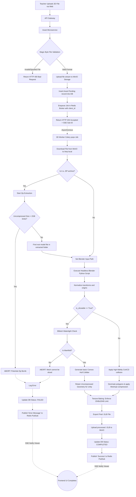

# 3D Asset Processing Pipeline Data Flow

This diagram illustrates the complex data flow and branching logic of the background 3D processing worker, specifically detailing how the system reacts to the `is_sliceable` parameter and potential Zip bombs.

