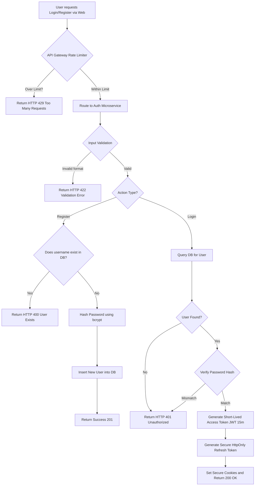

# Authentication & Authorization Data Flow

This diagram illustrates the logical branching and data flow for user authentication, incorporating the planned microservice security strategies.

```mermaid
graph TD
    A[User requests Login/Register via Web] --> B{API Gateway Rate Limiter}
    
    B -- Over Limit? --> C[Return HTTP 429 Too Many Requests]
    B -- Within Limit --> D[Route to Auth Microservice]
    
    D --> E{Input Validation}
    E -- Invalid format --> F[Return HTTP 422 Validation Error]
    E -- Valid --> G{Action Type?}
    
    G -- Register --> H{Does username exist in DB?}
    H -- Yes --> I[Return HTTP 400 User Exists]
    H -- No --> J[Hash Password using bcrypt]
    J --> K[Insert New User into DB]
    K --> L[Return Success 201]
    
    G -- Login --> M[Query DB for User]
    M --> N{User Found?}
    N -- No --> O[Return HTTP 401 Unauthorized]
    N -- Yes --> P{Verify Password Hash}
    
    P -- Mismatch --> O
    P -- Match --> Q[Generate Short-Lived Access Token JWT 15m]
    Q --> R[Generate Secure HttpOnly Refresh Token]
    R --> S[Set Secure Cookies and Return 200 OK]
```
