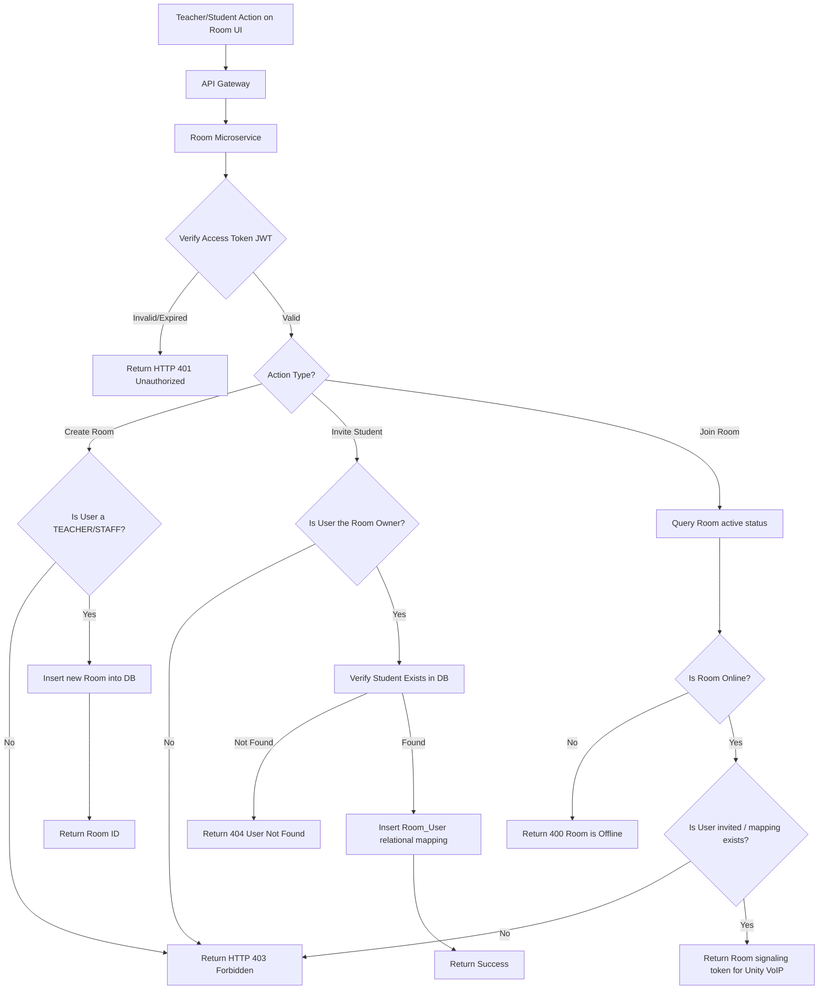

# Room Management & Joining Data Flow

This diagram illustrates the data flow for creating, managing, and joining VR educational rooms.

```mermaid
graph TD
    A[Teacher/Student Action on Room UI] --> B[API Gateway]
    B --> C[Room Microservice]
    C --> D{Verify Access Token JWT}
    
    D -- Invalid/Expired --> E[Return HTTP 401 Unauthorized]
    D -- Valid --> F{Action Type?}
    
    F -- Create Room --> G{Is User a TEACHER/STAFF?}
    G -- No --> H[Return HTTP 403 Forbidden]
    G -- Yes --> I[Insert new Room into DB]
    I --> J[Return Room ID]
    
    F -- Invite Student --> K{Is User the Room Owner?}
    K -- No --> H
    K -- Yes --> L[Verify Student Exists in DB]
    L -- Not Found --> M[Return 404 User Not Found]
    L -- Found --> N[Insert Room_User relational mapping]
    N --> O[Return Success]
    
    F -- Join Room --> P[Query Room active status]
    P --> Q{Is Room Online?}
    Q -- No --> R[Return 400 Room is Offline]
    Q -- Yes --> S{Is User invited / mapping exists?}
    S -- No --> H
    S -- Yes --> T[Return Room signaling token for Unity VoIP]
```
