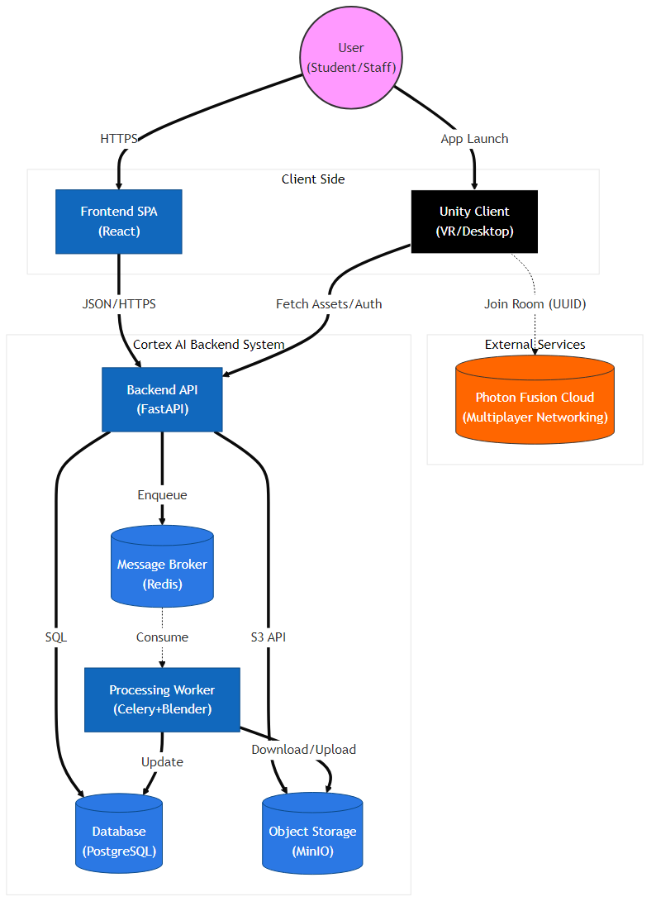

# System Architecture

## High-Level Overview

Cortex AI Pipeline is a web-based 3D asset management and collaboration system. It allows users (Students and Staff) to upload 3D models (and other media), which are then automatically processed, optimized, and prepared for web viewing. The system also supports "Rooms" for real-time collaboration.

The application serves two main purposes:

1.  **Asset Pipeline:** Automated ingestion, validation, and conversion of 3D assets (GLTF, FBX, OBJ, Blend) into web-optimized GLB files.
2.  **Collaboration:** Managing virtual rooms where authenticated users can interact with these assets.

## Subsystems & Communication

### 1. Frontend (Client)

- **Tech:** React (Vite, TypeScript, TailwindCSS).
- **Role:** User interface for uploading assets, managing rooms, and viewing 3D models.
- **Communication:** Sends HTTP REST requests to the **Backend API**.

### 2. Backend API

- **Tech:** Python (FastAPI), SQLAlchemy.
- **Role:** Handles authentication, business logic, file upload coordination, and database management.
- **Communication:**
  - **DB:** Reads/Writes metadata to **PostgreSQL**.
  - **Storage:** Streams file uploads to **MinIO (S3)**.
  - **Queue:** Offloads heavy 3D processing tasks to the **Celery Worker** via **Redis**.

### 3. Celery Worker (Processing Engine)

- **Tech:** Python (Celery), Blender 3.6 LTS, gltfpack.
- **Role:** Performs heavy computational tasks in the background. Does NOT handle HTTP requests.
- **Tasks:**
  - Downloads raw asset from **MinIO**.
  - Validates 3D model geometry and textures.
  - Runs headless **Blender** scripts (`process_model.py`) to normalize and export to GLB.
  - Uploads processed artifacts back to **MinIO**.
  - Updates status in **PostgreSQL**.

### 4. Database (Persistence)

- **Tech:** PostgreSQL 15.
- **Role:** Stores relational data: Users, Assets, Rooms, Memberships.

### 5. Object Storage (MinIO)

- **Tech:** MinIO (S3-compatible).
- **Role:** Stores binary files (Raw uploads and Processed GLBs).

### 6. Message Broker (Redis)

- **Tech:** Redis 7.
- **Role:** Orchestrates task queues between API and Worker.

## C4 Context Diagram

