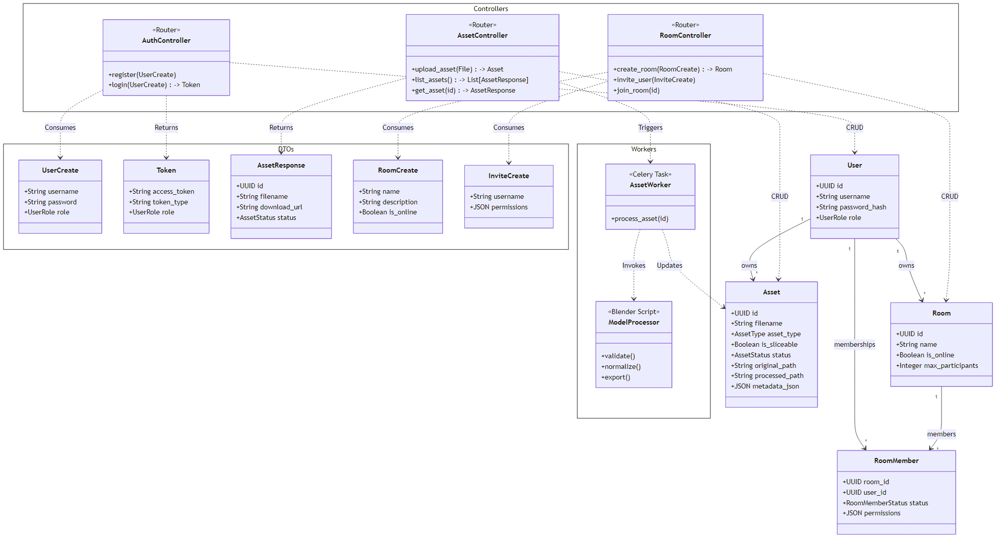

# Detailed Class & Data Structure

## 1. Data Models (SQLAlchemy)

The system uses PostgreSQL with SQLAlchemy ORM.

### Models (`backend/models.py`)

#### `User`

- **Table:** `users`
- **Attributes:**
  - `id` (Uuid, Primary Key)
  - `username` (String, Unique)
  - `password_hash` (String)
  - `role` (Enum: `STAFF` \| `STUDENT`)
- **Relationships:**
  - `assets`: One-to-Many -> `Asset`
  - `owned_rooms`: One-to-Many -> `Room`
  - `room_memberships`: One-to-Many -> `RoomMember`

#### `Asset`

- **Table:** `assets`
- **Attributes:**
  - `id` (Uuid, Primary Key)
  - `owner_id` (Uuid, ForeignKey `users.id`)
  - `filename` (String)
  - `asset_type` (Enum: `MODEL` \| `VIDEO` \| `SLIDE` \| `IMAGE`)
  - `is_sliceable` (Boolean) - _Specific to 3D Models_
  - `status` (Enum: `PENDING` \| `PROCESSING` \| `COMPLETED` \| `FAILED`)
  - `original_path` (String) - S3 Key for raw upload
  - `processed_path` (String) - S3 Key for optimized/GLB result
  - `metadata_json` (JSON) - Arbitrary metadata (e.g. valid interaction types)
- **Relationships:**
  - `owner`: Many-to-One -> `User`

#### `Room`

- **Table:** `rooms`
- **Attributes:**
  - `id` (Uuid, Primary Key)
  - `name` (String)
  - `description` (String, Nullable)
  - `owner_id` (Uuid, ForeignKey `users.id`)
  - `is_online` (Boolean)
  - `max_participants` (Integer)
  - `created_at` (DateTime)
- **Relationships:**
  - `owner`: Many-to-One -> `User`
  - `members`: One-to-Many -> `RoomMember`

#### `RoomMember`

- **Table:** `room_members`
- **Attributes:**
  - `room_id` (Uuid, ForeignKey `rooms.id`, PK)
  - `user_id` (Uuid, ForeignKey `users.id`, PK)
  - `status` (Enum: `INVITED` \| `JOINED`)
  - `permissions` (JSON) - e.g. `{"can_slice": true}`
- **Relationships:**
  - `room`: Many-to-One -> `Room`
  - `user`: Many-to-One -> `User`

## 2. Business Logic & Controllers

Although implemented as Python modules/functions, these components represent the system's logical class structure.

### Controllers (Routers)

#### `AuthController` (`routers/auth.py`)

- **Responsibilities:**
  - `register(UserCreate)`: Creates new users.
  - `login(UserLogin)`: Authenticates and issues JWTs.

#### `AssetController` (`routers/assets.py`)

- **Responsibilities:**
  - `upload_asset(File)`: Handles multipart uploads, streams to S3, creates DB entry.
  - `list_assets()`: Retrieves user's assets.
  - `get_asset(id)`: Generates presigned download URLs.
  - `delete_asset(id)`: Removes file from S3 and DB.

#### `RoomController` (`routers/rooms.py`)

- **Responsibilities:**
  - `create_room()`: Staff only.
  - `invite_user()`: Adds pending memberships.
  - `join_room()`: Confirms membership.

### Services & Workers

#### `AssetWorker` (`worker.py`)

- **Type:** Celery Task
- **Methods:**
  - `process_asset(asset_id)`: Orchestrates the 3D pipeline.
  - Handles ZIP extraction, S3 downloads, and Blender invocation.

#### `ModelProcessor` (`process_model.py`)

- **Type:** Blender Script
- **Methods:**
  - `validate_model()`: Checks geometry/textures.
  - `auto_connect_textures()`: Intelligent material repair.
  - `fix_transparency()`: Corrects alpha blend modes.
  - `normalize_model()`: Scales and centers the scene.

## 3. Data Transfer Objects (DTOs)

These Pydantic models define the structure of data sent to and from the API.

- **Auth:** `UserCreate` (Registration), `Token` (JWT Response).
- **Assets:** `AssetResponse` (includes computed `download_url`).
- **Rooms:** `RoomCreate`, `InviteCreate`.

## Class Diagram

This diagram maps the relationships between **Database Entities**, **DTOs**, and **Controllers**.

