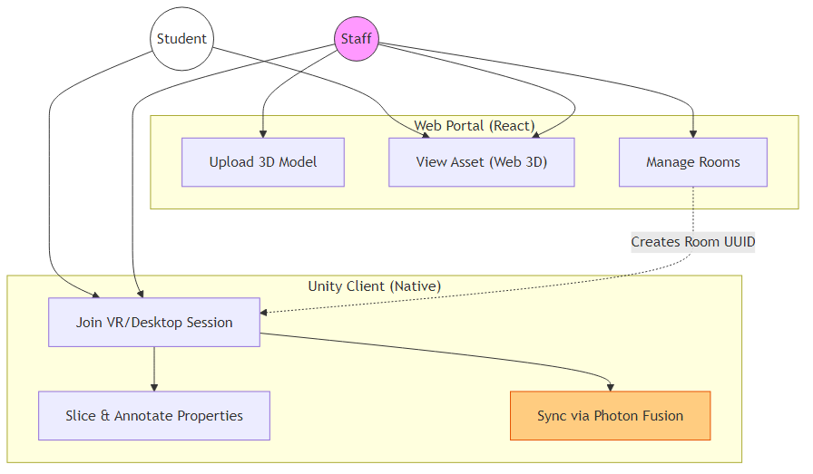
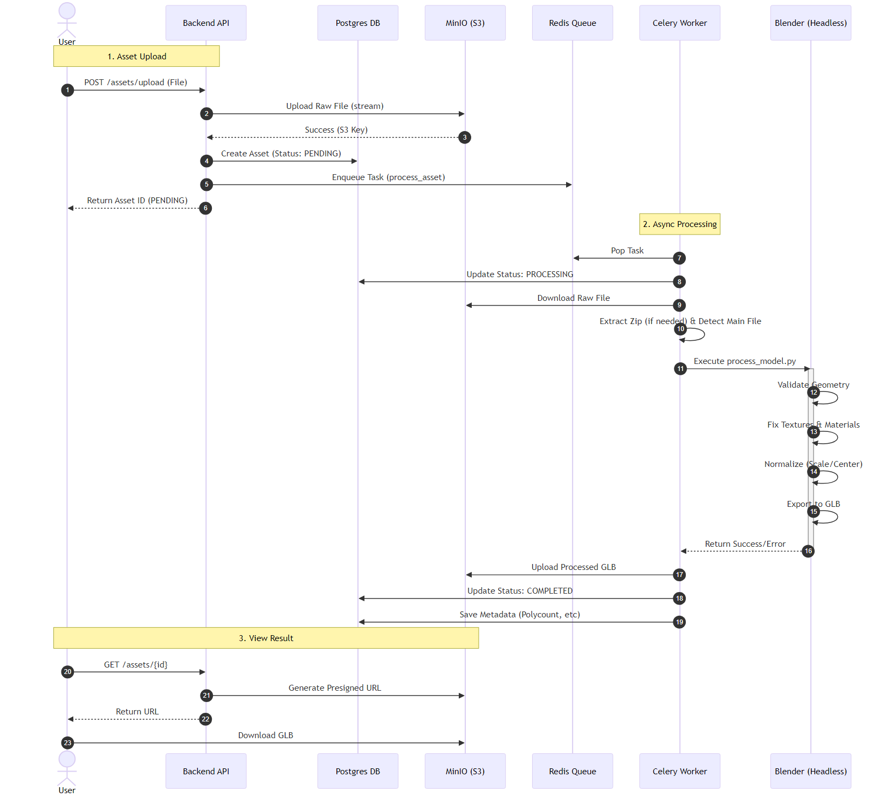
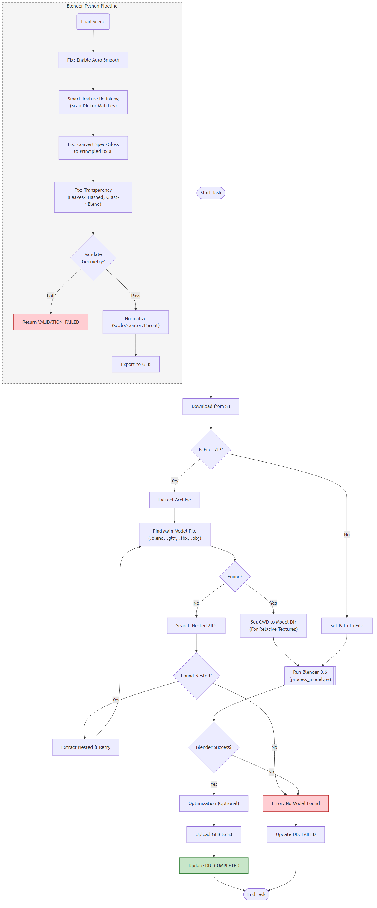
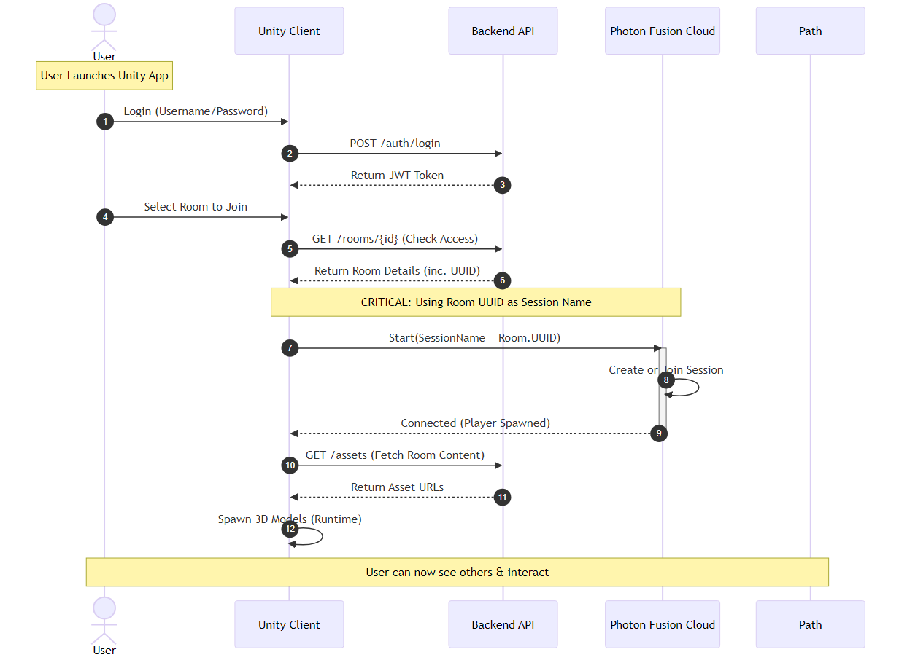

# Process Flows & User Interactions

This document details the high-level user interactions and the low-level technical sequences of the Cortex AI Pipeline.

## 1. User Capabilities (High Level)

The following diagram illustrates the capabilities of the two main user roles: **Student** and **Staff**.

- **Students** focus on managing their own assets and joining collaboration sessions.
- **Staff** have elevated privileges to **Create Rooms** and **Invite Users**.

## 2. Asset Processing Pipeline (Low Level)

This detailed Sequence Diagram traces the lifecycle of a 3D asset from the moment a user uploads it until it is ready for viewing.

**Key Steps:**

1.  **Synchronous Upload:** The API streams the file to S3 immediately to ensure data safety.
2.  **Asynchronous Processing:** The complex heavy lifting (Blender validation, conversion) happens in the background worker, decoupled from the API.
3.  **Headless Blender:** We invoke a purely command-line instance of Blender to perform geometry operations that Python libraries alone cannot handle.

## 3. Internal Processor Logic (Detailed)

This flowchart visualizes the exact decision making inside the `worker` and the `Blender` script. It highlights how we handle:

- **ZIP Extraction:** Recursive searching for nested archives.
- **Smart Relinking:** The logic used to find lost textures.
- **Validation:** Where the "Corrupt Geometry" checks happen.

## 4. Multiplayer Connection Logic (Unity + Photon)

This sequence details how the **Unity Client** establishes a realtime shared session.

**Core Concept:**

1.  The **Backend** creates a Room and assigns it a unique `UUID`.
2.  The **Client** joins a **Photon Fusion Session** using that exact `UUID` as the session name.
3.  This ensures that all users who "Join Room X" in the API end up in the same Photon simulation.

