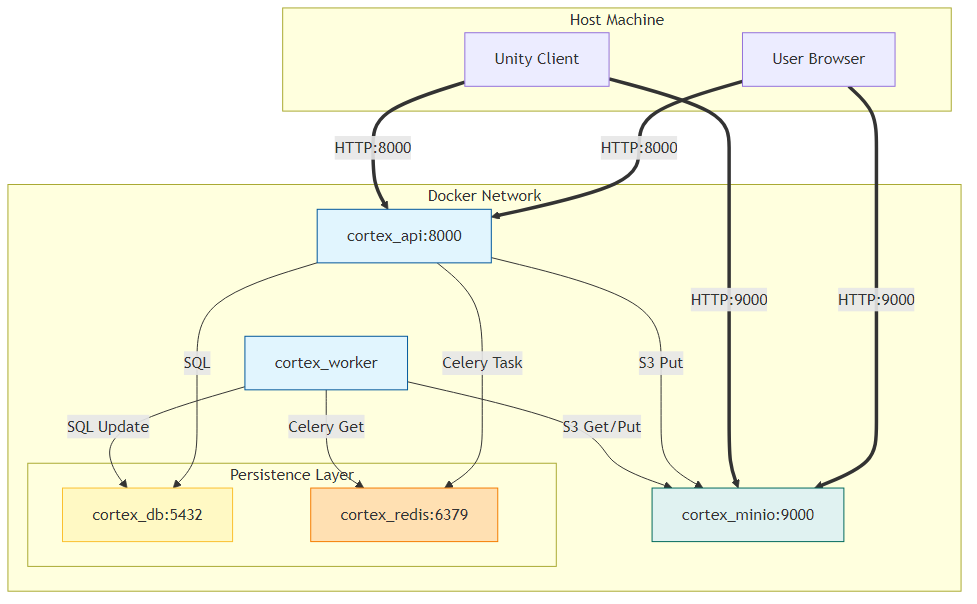

# Infrastructure & Docker Setup

The system is containerized using Docker Compose, orchestrating 5 interconnected services.

## Container Map

| Service Name | Container Name  | Image / Build        | Internal Port         | Host Port  | Purpose                                                 |
| :----------- | :-------------- | :------------------- | :-------------------- | :--------- | :------------------------------------------------------ |
| **api**      | `cortex_api`    | `backend/Dockerfile` | 8000                  | 8000       | Main REST API server (FastAPI).                         |
| **worker**   | `cortex_worker` | `backend/Dockerfile` | N/A                   | N/A        | Background worker for 3D processing (Celery + Blender). |
| **db**       | `cortex_db`     | `postgres:15`        | 5432                  | 5432       | Relational database (PostgreSQL).                       |
| **redis**    | `cortex_redis`  | `redis:7`            | 6379                  | N/A        | Message broker for Celery tasks.                        |
| **minio**    | `cortex_minio`  | `minio/minio`        | 9000 (API), 9001 (UI) | 9000, 9001 | S3-compatible object storage.                           |

### Note on `backend/Dockerfile`

The `api` and `worker` services share the same `Dockerfile`.

- **Base:** `python:3.10-slim`
- **System Deps:** Installs `libx11`, `libgl1`, etc., required for headless Blender.
- **Blender:** Downloads and installs Blender 3.6.4 LTS manually to `/usr/local/blender`.
- **Tools:** Installs `gltfpack` v0.25 (meshoptimizer) for optimization.
- **Python Deps:** Installs from `requirements.txt`.

## Networking

All services run on the default bridge network created by Docker Compose. They communicate using their service names as hostnames:

- API connects to DB via `db:5432`.
- API connects to Redis via `redis:6379`.
- API connects to MinIO via `minio:9000`.

## Volumes (Data Persistence)

| Volume Name     | Service         | Mount Path                 | Description                                         |
| :-------------- | :-------------- | :------------------------- | :-------------------------------------------------- |
| `postgres_data` | `db`            | `/var/lib/postgresql/data` | Persists PostgreSQL database files.                 |
| `minio_data`    | `minio`         | `/data`                    | Persists uploaded files (S3 objects).               |
| `(Bind Mount)`  | `api`, `worker` | `./backend:/app`           | Hot-reloading: Maps local source code to container. |

## Infrastructure Diagram

